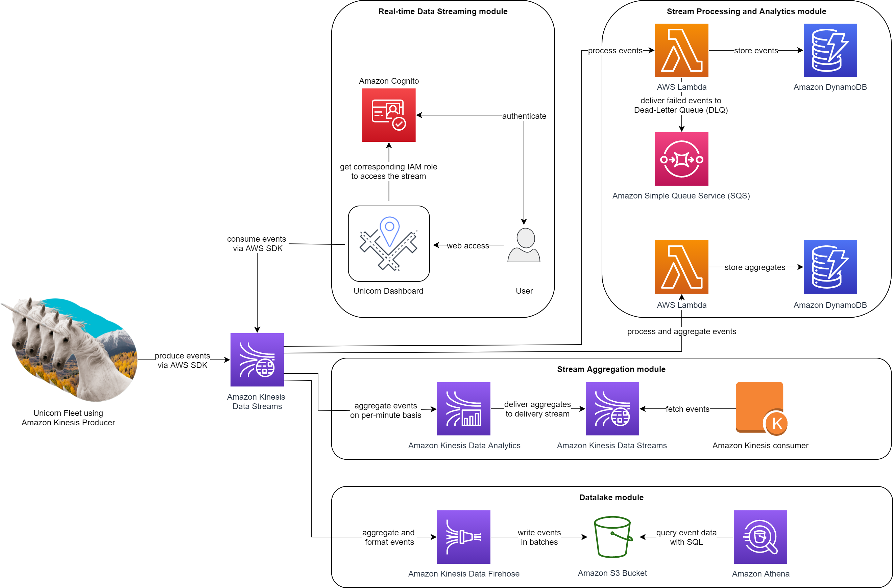

# Unicorn Rydes

## Overview

This project uses AWS services to process real-time data streams without managing servers. Wild Rydes introduces an innovative transportation service that offers unicorn rydes to help people get to their destination faster and hassle-free. Each unicorn is equipped with a sensor that reports its location and vital signs. We build infrastructure to enable operations personnel at Wild Rydes to monitor the health and status of their unicorn fleet. We use AWS to build applications that process and visualize the unicorn data in real-time.

## Resources

Producer and consumer are downloaded from https://data-processing.serverlessworkshops.io/client/client.tar

### Producer

The producer generates sensor data from a unicorn taking a passenger on a Wild Ryde. Each second, it emits the location of the unicorn as a latitude and longitude point, the distance traveled in meters in the previous second, and the unicorn's current level of magic and health points.

### Consumer

The consumer reads and displays formatted JSON messages from an Amazon Kinesis stream which allow us to monitor in real-time what's being sent to the stream. Using the consumer, you can monitor the data the producer and your applications are sending.

Once we send and receive data from the stream, we can use the unicorn dashboard to view the current position and vitals of our unicorn fleet in real-time.
https://d9ambsihrwoxf.cloudfront.net/

### AWS Resources

Access Management (IAM), Amazon Cognito, Amazon Kinesis, Amazon S3, Amazon Athena, Amazon DynamoDB, and AWS Cloud9

### Architecture Graph

## Project Steps

### Step 1: Set up an AWS Account and Configure the Environment

Sign in to the AWS Management Console and configure the environment by selecting the US East (N. Virginia) region.

### Step 2: Create a Kinesis Data Stream

Navigate to the Kinesis console and select "Create data stream". Provide a name for the data stream and specify the number of shards.

### Step 3: Set up a Data Producer

Set up a data producer using the provided Python script to send data to the Kinesis Data Stream. Install the required AWS SDK for Python (Boto3) and configure AWS credentials for authentication.

### Step 4: Start Sending Data to the Stream

Run the script to send simulated data to the Kinesis Data Stream.

### Step 5: Create a Kinesis Data Analytics Application

Create a Kinesis Data Analytics application in the Kinesis console. Set up the source as the data stream created earlier and connect the application to the data stream.

### Step 6: Write a SQL Query for Real-Time Data Processing

Use the built-in SQL editor in the Kinesis Data Analytics application to write a SQL query for processing data in real-time.

### Step 7: Create a Kinesis Data Firehose Delivery Stream

Create a Kinesis Data Firehose Delivery Stream with the destination set as an Amazon S3 bucket. Specify the time interval for data buffering.

### Step 8: Connect the Analytics Application to the Firehose Delivery Stream

Connect the Kinesis Data Analytics application to the Firehose Delivery Stream by adding it as the destination for the SQL query results. This allows the processed data to be continuously delivered to the S3 bucket for storage and further analysis.
